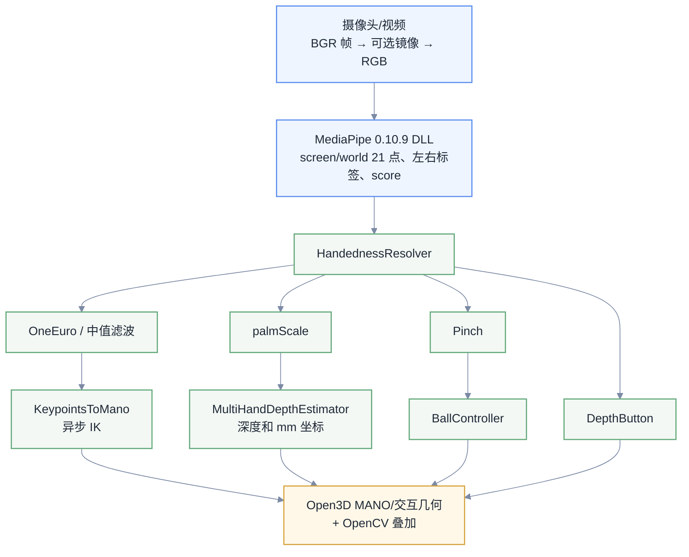

## 1. 流程介绍

- Qt：应用入口、命令行参数、启动器、配置选择和事件循环。
- OpenCV：摄像头或视频读取、颜色转换、二维关键点及状态文字叠加。
- Open3D：三维窗口和几何体更新。
- MediaPipe：通过独立 DLL 输出手部检测结果。
- 根目录 `core.*`：MANO、IK、跟踪、深度和交互逻辑；`skeleton.cpp`：骨架位姿与场景坐标转换。



### 运行时组件

| 组件 | 位置 | 功能 |
|:---|:---|:---|
| 程序入口 | `main.cpp` | 解析参数、定位项目根目录、加载模式和启动 Qt 启动器 |
| 应用循环 | `application.cpp` | 加载并校验配置、采集帧、调用检测器、协调状态、更新 OpenCV/Open3D 窗口 |
| 检测器适配 | `detector.cpp`、`mediapipe_bridge/` | 用 `QLibrary` 加载 DLL，通过 C ABI 调用展开后的 Hands graph |
| 核心算法 | `core.cpp`、`core.h`、`skeleton.cpp` | MANO 模型、关键点到姿态、骨架、滤波、左右手身份、深度、捏合、按钮和球控制 |
| MediaPipe 资源 | `assets/` | 展开的 `hands_0_10_9.pbtxt`、TFLite 模型和资源哈希 |
| MANO 资源 | `models/` | `MANO_LEFT.bin`、`MANO_RIGHT.bin` 及源模型哈希 |
| 模式配置 | `configs/viewer.json`、`configs/interaction*.json`、`configs/parallel_ik*.json` | 摄像头、检测、XNNPACK/IK 并行度、跟踪、深度和交互参数 |
| 差分测试 | `tests/` | 与 Python fixture 对比核心算法、当前同步行为、骨架/IK 行为，并检查并行配置 |
| 构建/转换工具 | `tools/` | 下载依赖、构建 MediaPipe 和 Qt 程序、部署运行库、生成 Python 对照数据 |

---

## 2. 单帧处理顺序

`runApplication()` 由 `captureWorker` 完成摄像头读取和 MediaPipe 推理，完成后通过 Qt queued invocation 把数据包投递到主线程，不再用 1 ms 定时器轮询 `future`。独立的渲染定时器只负责窗口事件和 dirty render，并根据有手/空闲状态切换频率。处理顺序如下：

1. `captureWorker` 读取 BGR 帧，按 `camera.mirror` 可选镜像，再转换为 RGB。
2. `Detector::process()` 返回每只手的 21 个归一化屏幕关键点、21 个世界关键点、左右标签和置信度；按 `detector_fps` 或 `idle_detector_fps` 安排下一次采集。
3. 按 `tracking.handedness_map` 修正标签，收集已完成的 IK 任务，再由 `HandednessResolver` 将检测结果关联到固定的左右 `HandState`。
4. 用有效手掌关键点计算 `palmScale`，将手掌尺寸交给 `MultiHandDepthEstimator`，得到每只手的深度。
5. 更新 `HandState`：`HandState::filter` 滤波世界关键点，`positionFilter` 滤波屏幕腕点；`screenTranslation()` 计算场景平移，`scenePositionFilter` 滤波场景 XY 位置。
6. 处理交互模式的捏合状态，然后清理未观测手的待处理数据，并为每只手提交最新的异步 IK 任务。
7. 更新小球控制、按钮碰撞和交互标记。
8. 将 MANO 顶点转换到场景坐标；只有几何体、相机视角或交互状态变化时才标记 Open3D 场景需要重绘。
9. 在 OpenCV 图像上绘制关键点、状态以及 timer、检测、渲染、由 IK worker 周期耗时计算的结算 FPS/配置上限，处理按键及限帧退出条件。

---

## 3. MediaPipe DLL 接口

`mediapipe_bridge/bridge.h` 定义稳定的 C ABI：

| 函数 | 说明 |
|:---|:---|
| `m2m_create()` | 读取 `assets/hands_0_10_9.pbtxt`，设置检测/跟踪阈值和两个 XNNPACK 推理节点的线程数，初始化 graph，并用 `model_complexity`、`num_hands`、`use_prev_landmarks=true` 三个 side packet 启动 graph |
| `m2m_process()` | 接收 RGB 原始字节和 stride，复制到 `ImageFrame`，按时间戳提交输入，等待 graph 空闲后返回最多 `capacity` 只手 |
| `m2m_destroy()` | 关闭 graph 并释放检测器 |

`M2MHand` 是 C 结构体，包含 `side`、`score`、`screen[63]` 和 `world[63]` 四个字段；`screen` 和 `world` 各保存 21 个三维关键点。

DLL 读取 `multi_hand_landmarks`、`multi_hand_world_landmarks` 和 `multi_handedness` 三个输出流。

---

## 4. MANO 与 IK

### 4.1 模型文件

`models/MANO_LEFT.bin` 和 `MANO_RIGHT.bin` 使用 `tools/export_reference.py` 从 Python 的 `MANO_LEFT.npz`、`MANO_RIGHT.npz` 转换。源 `.npz` 使用 `numpy.load(..., allow_pickle=True)` 读取，转换文件按以下顺序写入 8 个矩阵：

PCA basis、PCA mean、16×778 关节回归器、蒙皮权重、778 个模板顶点、三角面索引、关节父节点和 135 列姿态形变基。

加载器校验矩阵尺寸、有限值、面索引和关节树。当前实现使用 778 个顶点、16 个 MANO 关节和 21 个输出关键点。

5 个扩展指尖来自模板顶点索引 `333、444、672、555、744`。

模型更新时，PCA 姿态先转换为 16×3 轴角参数，再通过 Rodrigues 旋转、姿态形变和线性混合蒙皮计算顶点。

### 4.2 `KeypointsToMano`

`KeypointsToMano::solve()` 的处理过程如下：

1. 以 MediaPipe 世界关键点的腕点为原点，用食指根部和小指根部建立手掌局部坐标系。
2. 当 `camera.mirror=true` 时对输入坐标执行 X 轴镜像，再按 `mpToMano` 重排 MediaPipe 与 MANO 的关键点索引。
3. 按 MANO 静态骨长重定向输入骨架，保持模型骨架尺寸。
4. 使用四个掌部点做 SVD 刚体对齐，再修正五条手指链的偏移。
5. 以 45 维 PCA 姿态为变量，使用带中性姿态正则的阻尼最小二乘和前向差分 Jacobian 拟合 21 个 MANO 关键点。
6. 已有上一帧姿态时，按 `pose_smoothing` 将当前解与上一帧姿态插值。

`cameraOriented()` 将拟合结果转换到相机方向，并以腕点为场景局部原点。

#### 并行实现

并行度由两个相互独立的参数控制：

- `detector.xnnpack_threads`：设置 MediaPipe graph 中两个 `InferenceCalculatorCpu` 节点各自使用的 XNNPACK 线程数。
- `mano.jacobian_workers`：设置每只手计算 IK 数值 Jacobian 时使用的持久 C++ 工作线程数。
- `mano.max_fps`：限制每只手 IK worker 的最高结算能力；计算提前完成时休眠到周期结束。达到提交间隔前只覆盖并保留最新关键点。界面中的 `IK solve/max FPS` 使用完整 worker 周期耗时计算。

`viewer` 和 `interaction` 配置为每只手使用单批计算（`jacobian_workers=1`）：一次展开全部参数扰动的姿态，并用矩阵运算批量计算指尖形变。`parallel_ik` 配置将每只手的参数扰动分为 4 批，交给 4 个持久 C++ 工作线程，合并差分列后更新 LM。

| 配置 | `xnnpack_threads` | `jacobian_workers` | 用途 |
|:---|---:|---:|:---|
| `interaction.json` | 4 | 1 | 默认交互配置 |
| `parallel_ik.json` | 4 | 4 | 并行 IK 模式默认配置 |
| `parallel_ik_16threads.json` | 16 | 4 | 16 个 XNNPACK 线程的并行 IK 配置 |

#### 实际测试

CPU 为 Intel Core i7-12700，摄像头分辨率为 640×480。

每个组合从首次检测到手开始运行 10 秒，取得 3 轮有效双手数据后，以三轮中位数进行比较。

| XNNPACK | Jacobian | MediaPipe/ms | MediaPipe P95/ms | IK/ms | IK P95/ms | 路径耗时/ms | CPU/% | 综合代价 |
|---:|---:|---:|---:|---:|---:|---:|---:|---:|
| 1 | 4 | 11.180 | 18.311 | 0.767 | 0.937 | 11.947 | **5.495** | 65.65 |
| 2 | 1 | 6.818 | 8.071 | 0.775 | 1.056 | 7.593 | 5.551 | 42.15 |
| 2 | 2 | 6.737 | 7.927 | 0.819 | 0.999 | 7.556 | 6.030 | 45.56 |
| 2 | 4 | 7.220 | 11.426 | 0.752 | 0.933 | 7.972 | 5.875 | 46.84 |
| 4 | 0 | **4.803** | 5.655 | 0.859 | 1.158 | 5.662 | 6.147 | 34.80 |
| 4 | 1 | 4.960 | 7.420 | 0.765 | 1.035 | 5.725 | 6.034 | 34.54 |
| 4 | 2 | 4.954 | 7.101 | 0.819 | 0.998 | 5.773 | 6.304 | 36.39 |
| 4 | 4 | 4.893 | 7.006 | 0.757 | 0.973 | 5.650 | 6.076 | **34.33** |
| 4 | 8 | 5.076 | 7.620 | 0.769 | 0.926 | 5.845 | 6.731 | 39.34 |
| 8 | 1 | 5.390 | 17.723 | 0.746 | **0.876** | 6.136 | 8.457 | 51.89 |
| 8 | 2 | 5.610 | 17.586 | 0.807 | 0.981 | 6.417 | 8.684 | 55.73 |
| 8 | 4 | 5.330 | 16.806 | 0.834 | 1.000 | 6.164 | 8.910 | 54.92 |
| 16 | 4 | 4.868 | **4.370** | **0.743** | 0.921 | **5.611** | 70.477 | 395.45 |

```text
路径耗时 = MediaPipe 平均耗时 + IK 平均耗时
综合代价 = 路径耗时 × CPU 占用
```

综合代价数值越低表示在当前测试环境中的延迟与 CPU 占用越均衡。

`jacobian_workers=0` 的逐列计算明显慢于单批计算，因此只保留为测试基线。

`jacobian_workers=4` 在 XNNPACK=4 时取得较低的 IK 延迟和稳定的尾延迟，CPU 开销与单批计算接近。

XNNPACK=16 虽然取得最低的 IK 中位数，但进程 CPU 占用约 70.5%，且出现明显延迟尖峰。

---

## 5. 坐标、滤波与深度

### 坐标及单位

- 屏幕关键点：`x/y` 归一化到 `[0, 1]`，原点在图像左上角。
- MediaPipe 世界关键点：以米为单位进入 IK 和捏合距离判断。
- MANO 和交互场景：以毫米为单位。`scenePoints()` 使用 `(x, -y, -z)` 变换，并加上腕点对应的场景平移。
- Open3D 正面视角：相机从负 Z 看向正 Z。
- 深度估计的 `reference_depth`、`minimum_depth`、`maximum_depth` 以及球/按钮坐标均为毫米。

### 掌部比例与深度

`palmScale()` 使用 5 组掌部线段，根据屏幕像素长度、世界方向投影和 MANO 固定骨长计算毫米/像素比例。手掌正对相机时更新各线段的校正值，侧向时使用已有校正值。

应用层将有效比例换算为手掌尺寸 `20 / palmScale`，交给 `MultiHandDepthEstimator`。深度计算逻辑为：

```text
raw_depth = reference_depth
          + (reference_depth * current_size / reference_size - reference_depth) * motion_gain
```

结果先限制在深度范围，再经过最大速度限制和 One Euro 滤波。

启动后使用 `calibration_frames` 帧有效样本的中位数建立双手共享基准。

按 Enter 后开始 3 秒倒计时。倒计时结束时，程序用当前有效手掌尺寸重新校准；只有一只手有效时，另一只手使用共享基准。

---

## 6. 配置说明

| 配置组 | 关键字段 | 作用 |
|:---|:---|:---|
| `camera` | `index`、`width`、`height`、`mirror` | 摄像头索引、采集分辨率和是否水平翻转输入帧 |
| `detector` | `model_complexity`、`max_hands`、`xnnpack_threads`、`min_detection_confidence`、`min_tracking_confidence` | MediaPipe 模型复杂度、最多检测手数、两个推理节点的线程数、检测阈值和跟踪阈值 |
| `performance` | `detector_fps`、`idle_detector_fps`、`render_fps`、`idle_render_fps` | 有手/空闲状态下的 MediaPipe 检测上限和 Open3D 事件/渲染上限 |
| `mano` | `executor`、`jacobian_workers`、`jacobian_backend`、`iterations`、`pose_smoothing`、`max_fps` | IK 执行器、每只手的 Jacobian 并行度、后端、迭代次数、姿态平滑系数和 worker 结算能力上限；计算提前完成时休眠，等待期间保留最新待处理帧 |
| `tracking` | `handedness_confirm_frames`、`handedness_map` | 左右手标签确认帧数，以及 `auto`、`direct`、`swapped` 标签映射 |
| `tracking.position_filter` | `min_cutoff`、`beta`、`derivative_cutoff`、`median_window`、`max_speed` | 控制屏幕腕点和场景位置的平滑、限速和中值窗口 |
| `depth_estimation` | `enabled`、`reference_depth`、`minimum_depth`、`maximum_depth`、`calibration_frames`、`min_cutoff`、`beta`、`max_speed`、`motion_gain` | 启用深度估计、设置毫米单位的参考/最小/最大深度、校准样本数以及深度滤波和运动增益 |
| `pinch` | `enter_distance`、`exit_distance`、`grab_tolerance`、`missing_timeout` | 捏合进入/退出阈值（米）、抓取容差（毫米）和丢失超时（秒） |
| `button` | `center`、`width`、`height`、`travel`、`tip_radius` | 深度按钮的坐标、尺寸、行程和指尖半径（毫米） |
| `ball` | `radius`、`center`、`minimum_scale`、`maximum_scale`、`scale_sensitivity` | 交互球的坐标、半径、缩放范围和双手缩放灵敏度（毫米） |

---

## 7. 启动与命令行

启动预览、交互或多线程模式：

```powershell
.\run_viewer.cmd
.\run_interaction.cmd
.\run_parallel_ik.cmd
```

或直接调用可执行文件（`--mode` 支持 `viewer`、`interaction`、`parallel_ik`）：

```powershell
.\Bin\MediaPipe2ManoQt.exe --mode viewer
.\Bin\MediaPipe2ManoQt.exe --mode interaction --config path/to/override.json
.\Bin\MediaPipe2ManoQt.exe --mode parallel_ik --config path/to/override.json
```

摄像头性能测试可使用 `--benchmark-seconds`。程序在首次检测到手后开始计时，到达指定时长后自动退出并输出 `BENCHMARK_RESULT`：

```powershell
.\Bin\MediaPipe2ManoQt.exe --mode interaction `
  --config .\configs\interaction_4threads.json `
  --benchmark-seconds 10
```

---

## 8. 构建与部署

`vs/` 保存各 CMake 目标对应的稳定
`.vcxproj` 包装工程，根目录保存自有 C++ 源码，`ThirdParty/` 和 `mediapipe_bridge/` 保存第三方开发依赖与桥接代码，
`Bin/` 保存可运行程序和 DLL。

### 开发环境

- Windows x64。
- Visual Studio 2022，安装“使用 C++ 的桌面开发”、MSVC v143、Windows SDK 和 CMake。
- CMake 3.24 或更高版本。
- Qt 6.8.3 `msvc2022_64`，包含 Core、Gui、Widgets。
- OpenCV C++ 4.12.0 Windows x64 SDK。
- Git Bash，供 Bazel 构建 MediaPipe 使用。
- Python 参考环境位于相邻项目 `..\Mediapipe2Mesh`，依赖清单为 `..\Mediapipe2Mesh\requirements.txt`；其中 MediaPipe 0.10.9、NumPy 1.24.4 和 OpenCV 4.10.0.84 已固定。

Open3D 0.19.0 开发包（含 Eigen 和 TBB）及 Bazel 6.1.1 放在 `ThirdParty/`。依赖下载地址和 SHA-256 记录在 `dependencies.lock.json`。

### 常规构建

在指定安装路径后，运行：

```powershell
powershell -NoProfile -ExecutionPolicy Bypass -File .\tools\build_mediapipe.ps1 `
  -Python "path/to/python.exe" `
  -OpenCvRoot "path/to/opencv/build" `
  -VisualCpp "path/to/Microsoft Visual Studio/2022/Community/VC" `
  -GitBash "path/to/Git/bin/bash.exe"
```

脚本执行以下操作：

1. 用 Visual Studio CMake 生成 x64 工程。
2. 编译 `mano_core`、`MediaPipe2ManoQt.exe` 和 4 个测试程序。
3. 将 Open3D、TBB、OpenCV 和 Qt 运行时部署到 `Bin/`。
4. 执行 `parity_tests.exe`、`sync_parity_tests.exe`、`skeleton_parity_tests.exe` 和 `config_profiles_tests.exe`。

CMake 目标包括 `mano_core`、`MediaPipe2ManoQt`、`parity_tests`、`sync_parity_tests`、`skeleton_parity_tests` 和 `config_profiles_tests`。已有 `build` 目录时可直接运行测试；SDK 不在脚本默认路径时，通过参数指定：

```powershell
ctest --test-dir .\build -C Release --output-on-failure
```

```powershell
powershell -NoProfile -ExecutionPolicy Bypass -File .\tools\build.ps1 `
  -QtRoot <QtRoot> `
  -OpenCvRoot <OpenCvRoot>
```

运行一次本机配置脚本：

```powershell
powershell -NoProfile -ExecutionPolicy Bypass `
  -File .\tools\configure_visual_studio.ps1 `
  -QtRoot <QtRoot> `
  -OpenCvRoot <OpenCvRoot>
```

脚本根据 `CMakeUserPresets.json.example` 生成 `CMakeUserPresets.json` 和
`vs/Local.Paths.props`。

### 重建 MediaPipe DLL

当 graph、TFLite 资源、MediaPipe 版本或 `mediapipe_bridge/` 代码发生变化时，重建 DLL：

```powershell
python .\tools\install_dependencies.py
powershell -NoProfile -ExecutionPolicy Bypass -File .\tools\build_mediapipe.ps1 `
  -Python "path/to/reference/python.exe" `
  -OpenCvRoot "path/to/opencv/build" `
  -VisualCpp "path/to/Microsoft Visual Studio/2022/Community/VC" `
  -GitBash "path/to/Git/bin/bash.exe"
powershell -NoProfile -ExecutionPolicy Bypass -File .\tools\build.ps1
```

`install_dependencies.py` 将 Open3D、Bazel 和 MediaPipe 源码下载到 `ThirdParty/`，并按 lock 文件中的 SHA-256 校验下载文件。

`build_mediapipe.ps1` 先调用 `prepare_mediapipe.py`，从 Python MediaPipe 0.10.9 包复制模型资源、展开 Hands graph 并写入 OpenCV 路径，再使用 Bazel 构建 `mediapipe_hands.dll`。

### 重新生成 fixture

工具默认 Python 源码位于当前项目的相邻目录 `..\Mediapipe2Mesh`：

```powershell
$ReferencePython = 'path/to/reference/python.exe'
& $ReferencePython .\tools\export_reference.py `
  --source ..\Mediapipe2Mesh --output .
& $ReferencePython .\tools\export_sync_reference.py `
  --source ..\Mediapipe2Mesh --output .
& $ReferencePython .\tools\export_skeleton_reference.py `
  --source ..\Mediapipe2Mesh --output .
```

`export_reference.py` 转换 MANO 文件，生成 `models/*.bin`、`models/source_hashes.json` 和 `tests/reference.json`；`export_sync_reference.py` 根据当前 Python 实现生成 `tests/sync_reference.json` 和 `validation/python_source_snapshot.json`；`export_skeleton_reference.py` 生成 `tests/skeleton_reference.json`。

修改 Python 算法后，先重新生成 fixture，再运行 C++ 测试。`tools/deploy_update.py` 在生成部署计划和应用更新前校验 Python 源文件哈希，使部署内容与 fixture 对应的参考实现保持一致。

---

## 9. 文件索引

```text
dependencies.lock.json                下载地址和 SHA-256
main.cpp                              CLI、Qt 启动器和资源检查
application.cpp                       配置、帧循环、窗口和渲染协调
core.h / core.cpp                     核心数据结构、MANO、IK、跟踪和交互算法
skeleton.cpp                          骨架位姿和场景坐标转换
skeleton_json.h                       骨架位姿 JSON 序列化
worker.h                              持久原生任务线程
detector.h / detector.cpp             QLibrary + MediaPipe C ABI 适配
mediapipe_bridge/                     Bazel 侧 MediaPipe C ABI 实现
configs/*.json                        viewer、interaction、parallel_ik 及线程数变体配置
models/*.bin                          转换后的 MANO 左右手模型
assets/                               MediaPipe graph、TFLite 模型和哈希
tools/build.ps1                       Qt/C++ 构建和运行时部署
tools/build_mediapipe.ps1             MediaPipe DLL 构建
tools/export_reference.py             MANO 转换和基础 fixture 生成
tools/export_sync_reference.py        当前 Python fixture 和源码快照生成
tools/export_skeleton_reference.py    骨架和 IK fixture 生成
```
